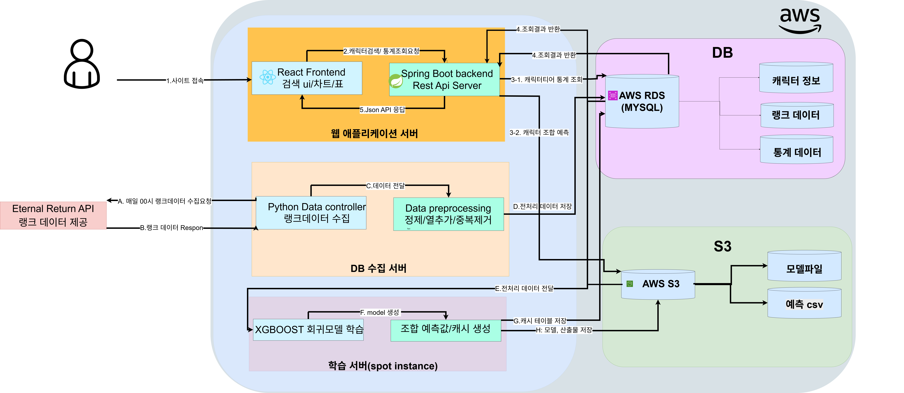

# 🎮 이리메타 (ERIMETA)

이터널 리턴(Eternal Return) 랭크 데이터를 수집·분석하여 캐릭터 통계와 3인 조합을 추천하는 웹 서비스입니다.

Open API를 통해 게임 데이터를 수집하고 전처리한 뒤 AWS RDS에 저장합니다. 저장된 데이터를 기반으로 캐릭터 통계와 티어 정보를 제공하며, XGBoost 회귀 모델을 활용하여 3인 조합의 예상 성능을 예측합니다.

실시간 모델 추론으로 발생하는 응답 지연을 해결하기 위해 모든 조합을 사전에 예측하여 캐시하는 구조를 적용하였으며, 이를 통해 서비스 응답 속도를 크게 개선했습니다.

---

# ✨ 주요 기능

## 🔍 캐릭터 검색

- 캐릭터 검색
- 무기별 통계 조회
- 승률
- 픽률
- 평균 순위 확인

---

## 🏆 티어 리스트

- 최신 랭크 데이터를 기반으로 티어 제공
- 캐릭터별 승률 및 픽률 확인

---

## 🤖 조합 추천

사용자가 선택한

- 캐릭터
- 무기

정보를 기반으로 XGBoost 모델이 예상 성능을 계산하여 높은 성능의 조합을 추천합니다.

---

## 📊 랭크 데이터 분석

- Eternal Return Open API 데이터 수집
- 데이터 전처리
- 통계 생성
- 머신러닝 학습 데이터 생성

---

# 🛠 Tech Stack

## Frontend

- React

## Backend

- Spring Boot
- Spring Data JPA

## AI / Data

- Python
- Pandas
- NumPy
- XGBoost

## Database

- MySQL (AWS RDS)

## Cloud

- AWS EC2
- AWS S3

---

# 🏗 시스템 아키텍처



```

# 🧠 머신러닝 모델

### Model

- XGBoost Regressor

### Target

3인 조합의 예상 Rank Point

### 학습 데이터

- Character
- Weapon
- Damage
- Kill
- 평균 Rank Tier
- 평균 MMR
- 평균 Rank Point
- Matching Mode

### Output

조합 예상 점수

---

# ⚡ 성능 개선

## Before

실시간 모델 추론

```text
사용자 요청

↓

XGBoost 추론

↓

20~30초
```

---

## After

배치 예측 + 캐시

```text
사용자 요청

↓

RDS 캐시 조회

↓

3~6초
```

### 개선 내용

- 모든 조합을 사전에 예측
- 예측 결과 캐싱
- 서비스에서는 RDS 조회만 수행
- 학습 서버와 서비스 서버 분리
- Spot Instance를 활용한 모델 학습
- 모델 파일 및 예측 결과를 S3에 저장

---

# 📂 프로젝트 구조

```text
ERIMETA

├── frontend
│   └── React
│
├── backend
│   └── Spring Boot
│
├── collector
│   └── Python
│
├── model
│   ├── preprocessing
│   ├── train
│   └── predict
│
├── docs
│
└── README.md
```

---

# 🚀 향후 개선 사항

- 최신 패치 자동 반영
- 자동 모델 재학습
- 추천 정확도 향상
- 포지션 기반 추천
- 개인 플레이 스타일 추천

---

# 💡 프로젝트를 통해 얻은 경험

- 대용량 게임 데이터 수집 및 전처리
- XGBoost 회귀 모델 학습 및 운영
- AWS 기반 서비스 구축
- RDS와 S3를 활용한 데이터 관리
- 캐시 기반 성능 최적화
- EC2 Spot Instance를 활용한 비용 절감
- 배치 처리와 실시간 서비스 분리 설계
